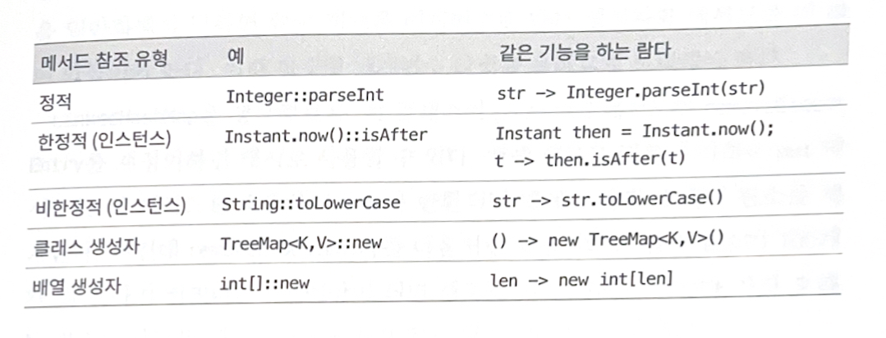

# Item 43. 람다보다는 메서드 참조를 사용하라
## 람다 vs 메서드 참조(method reference)

함수 객체를 람다보다도 간결하게 만드는 방법은 메서드 참조가 있다.

메서드 참조가 람다보다 더 간결하고 명확하다면 메서드 참조 방식을 사용하라, 아닌 경우에만 람다를 사용해라

### 메서드가 참조가 더 간결한 경우

- 람다를 이용한 방식
    
    ```java
    // 임의의 key 와 Integer 값을 매핑한다.
    map.merge(key, 1, (count, incr) -> count + incr);
    ```
    
    - Java 8 에 추가된 map 의 merge 메서드는 키, 값, 함수를 받는다.
    - 키가 맵에 없다면 {key, 1}을 저장한다.
    - 키가 있다면 원래 값(count) + 1(incr)으로 현재 값을 덮어쓴다. 즉 {key, 함수 결과} 를 저장한다.
    - 이때, count 와 incr 는 크게 하는 일 없이 공간을 꽤 차지하고 있다.
- 메서드 참조를 이용한 방식
    
    ```java
    map.merge(key, 1, Integer::sum);
    ```
    
    - Java 8에선 모든 기본 타입의 박싱 타입은 정적 메서드 sum을 제공하기 시작했다.
    - 인자를 받아 메서드로 전달됨
    - 람다 대신 sum 메서드의 참조를 전달하면 같은 결과를 얻는다.
- **메서드 참조의 장점**
    - 람다보다 훨씬 간결하다.
    - 매개변수 수가 늘어날수록 메서드 참조로 제거할 수 있는 코드양도 늘어난다.
    - 기능을 잘 드러내는 이름을 지어줄 수 있고 친절한 설명을 문서로 남길 수 있다.

___

### 람다가 더 간결한 경우

- 매개변수의 이름 자체가 개발자에게 좋은 가이드가 되기도 한다.
    - 이땐, 길이는 더 길지만 메서드 참조보다 가독성이 좋고 유지보수도 더 쉬울 수 있다.
- 또한, 람다가 더 간결할 때가 있다.
- 메서드와 람다가 같은 클래스에 있는 경우
    - 메서드 참조를 이용한 방식
    
    ```java
    // 메서드 참조를 위해 클래스명을 명시해주어야 하므로 길어진다.
    service.execute(GoshThisClassNameIsHumongous::action);
    ```
    
    - 람다를 이용한 방식
    
    ```java
    service.execute(() -> action()); // 그냥 간결하게 호출
    ```
    
- 제네릭 정적 팩터리 메서드 Function.identity() 사용
    - 항등함수인 Function.identity() 호출보다 (x → x) 가 더 직관적이고 간결
    - 입력값과 반환값이 같다는 것을 바로 알 수 있다.

## 메서드 참조 유형



- **정적 메서드 참조**
    - 가장 흔한 예제로 앞서 본 코드 예제이다.
    - 함수 객체가 받는 인수와 참조되는 메서드가 받는 인수가 똑같다.
    - `클래스명::정적메서드명`
- **한정적 인스턴스 메서드 참조**
    - 수신 객체(receiving obvject, 참조 대상 인스턴스)를 특정함, 즉 이미 정해짐
    - 정적 메서드 참조와 비슷한 방식이다.
    - 즉, 함수 객체가 받는 인수와 참조되는 메서드가 받는 인수가 똑같다.
- **비한정적 인스턴스 메서드 참조**
    - 수신 객체를 특정하지 않음
    - 함수 객체를 적용하는 시점에 수신 객체를 알려준다.
    - 따라서, 수신 객체 전달용 매개변수가 매개변수 목록의 첫 번째로 추가되고 뒤로 참조되는 메서드 선언에 정의된 매개변수들이 뒤따른다.
        - 람다로 바꾸면 (a, b) -> a.equals(b) 와 같다.
        - a 가 수신 객체, b 는 인자로 들어간다.
    - 주로 스트림 파이프라인에서의 매핑과 필터 함수에 쓰인다.
    
    ```java
    List<String> list = List.of("apple", "banana", "cherry");
    
    boolean result = list.stream()
        .map(String::toUpperCase)  // 비한정적 인스턴스 메서드 참조 s -> s.toUpperCase()
        .anyMatch("BANANA"::equals); // 한정적 메서드 참조, s -> "BANANA".equals(s)
    ```
    
- **클래스 생성자 참조**
    - 팩터리 객체로 사용된다.
- **배열 생성자 참조**

## 요약 정리
- 람다보다 더 간결하게 메서드 참조를 사용할 수 있다.
- 메서드 참조 쪽이 짧고 명확하다면 메서드 참조를 쓰고, 그렇지 않을 때만 람다를 사용해라